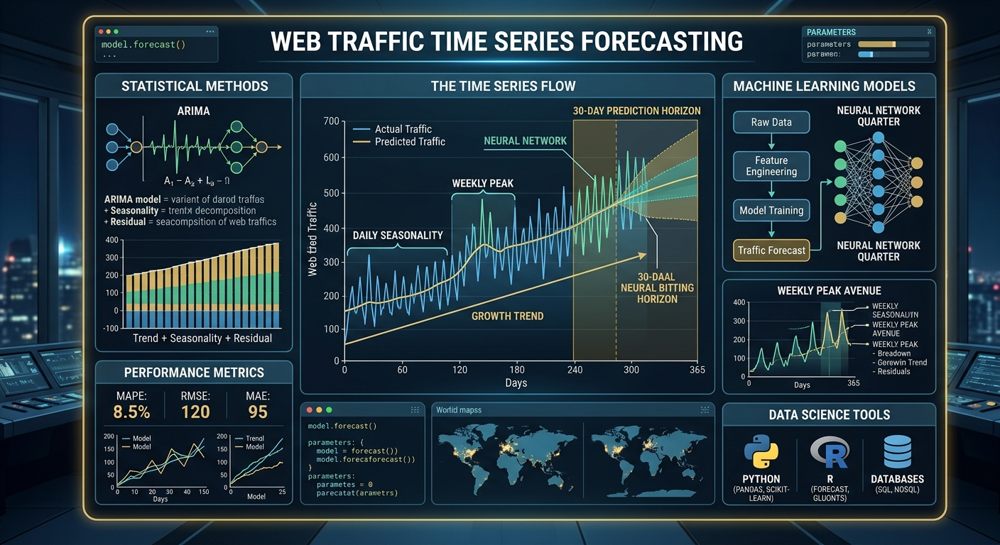

# Introduction

Forecasting web traffic is a useful example of a real-world time-series problem: observations arrive sequentially, individual pages can behave differently, short-term volatility can be substantial, and the model that performs well for one series may not be the best choice for another. A robust forecasting workflow therefore needs to do more than fit a single algorithm—it should prepare and diagnose the data, evaluate competing models on unseen observations, select models using a consistent criterion, quantify forecast uncertainty, and refit the selected models before generating future predictions.

This project develops an end-to-end **nested forecasting workflow in R** for four daily Wikipedia web-traffic series. The analysis uses the `tidymodels`, `timetk`, and `modeltime` ecosystems to compare three machine-learning approaches: **XGBoost**, **Random Forest**, and **K-Nearest Neighbors (KNN)**. Each page is modeled independently, allowing the best-performing algorithm to differ across series.

The project has four main objectives:

1.  Prepare and explore the daily web-traffic series, including anomaly assessment and treatment.
2.  Engineer calendar-based features that machine-learning algorithms can use for forecasting.
3.  Evaluate competing models on a held-out test period using **RMSE** and **MAE**, then select the best model for each page using **MAE**.
4.  Refit the selected models on all available historical observations and generate a **90-day forecast** with prediction intervals.

The web traffic data used in this project was sourced from the **Web Traffic Time Series Forecasting competition dataset** available on the [Kaggle platform](https://www.kaggle.com/competitions/web-traffic-time-series-forecasting/data).

# Environment Setup

The analysis is conducted in R using the `tidyverse`, `timetk`, `modeltime`, and `tidymodels` ecosystems for data preparation, time-series analysis, modeling, and evaluation. These packages provide a consistent and reproducible framework for feature engineering, model specification, workflow construction, evaluation, and nested forecasting.

```{r setup, message=FALSE, warning=FALSE}
# Display large numbers without scientific notation
options(scipen = 999)

# Reproducibility for stochastic model engines
set.seed(2026)

# Rendering settings
knitr::opts_chunk$set(
  fig.width = 9,
  fig.height = 7,
  fig.align = "center",
  message = FALSE,
  warning = FALSE,
  out.width = "100%"
)

# Load required packages
pacman::p_load(
  tidyverse,
  janitor,
  timetk,
  modeltime,
  tidymodels
)
```

# Data Preparation and Exploratory Analysis

## Load the data

We begin by loading the web-traffic dataset and inspecting the first observations to understand its structure.

```{r load-data}
web_traffic_data <- read_csv(
  "data/web_traffic_data.csv",
  show_col_types = FALSE
)

web_traffic_data |>
  head()
```

## Reshape and clean the data

The raw dataset is stored in wide format, with dates spread across columns. For time-series modeling, we reshape it into a tidy long format containing one observation per page and date. We also convert the period field to a proper date, standardize column names, and sort each page chronologically.

```{r clean-data}
web_traffic_data_clean <- web_traffic_data |>
  select(-1) |>
  pivot_longer(
    2:last_col(),
    names_to = "period",
    values_to = "value"
  ) |>
  mutate(period = ymd(period)) |>
  arrange(Page, period) |>
  clean_names() |>
  rename(id = page)

web_traffic_data_clean |>
  head()
```

## Check data completeness

Missing dates or traffic values can affect feature generation, model fitting, and forecast evaluation. We therefore check the core time-series fields before proceeding.

```{r missing-values}
web_traffic_data_clean |>
  filter(is.na(value) | is.na(period)) |>
  nrow()
```

## Explore historical traffic

We first visualize the daily traffic for each page. This provides an initial view of long-term movement, variability, possible recurring patterns, and unusually large spikes or drops.

```{r historical-traffic}
web_traffic_data_clean |>
  plot_time_series(
    .date_var = period,
    .value = value,
    .facet_ncol = 2,
    .facet_scales = "free",
    .facet_collapse = TRUE,
    .facet_vars = c(id),
    .color_var = year(period),
    .title = "Historical Web Traffic by Page",
    .y_lab = "Visits",
    .x_lab = "Date"
  )
```

## Diagnose anomalies

The initial visualization contains clear spikes that may have negative influence on model estimation. We use anomaly diagnostics to identify observations that depart strongly from the local behavior of each series.

```{r anomaly-diagnostics}
web_traffic_data_clean |>
  plot_anomaly_diagnostics(
    .date_var = period,
    .value = value,
    .facet_ncol = 2,
    .facet_scales = "free",
    .facet_collapse = TRUE,
    .facet_vars = c(id),
    .message = FALSE,
    .title = "Anomaly Diagnostics for Daily Web Traffic",
    .y_lab = "Visits",
    .x_lab = "Date"
  )
```

## Treat anomalous observations

Anomaly treatment is performed separately for each page so that unusually large or small observations do not dominate model fitting. The cleaned observations returned by `anomalize()` are retained as the modeling series and rounded to whole visits.

```{r treat-anomalies}
web_traffic_data_anomalized <- web_traffic_data_clean |>
  group_by(id) |>
  anomalize(period, value) |>
  relocate(observed_clean, .after = observed) |>
  transmute(id, period, value = round(observed_clean)) |>
  ungroup()
```

This treatment assumes that the detected anomalies are unwanted disturbances rather than events whose recurrence should be explicitly modeled.

## Re-evaluate the cleaned series

After anomaly treatment, we repeat the diagnostics to assess whether extreme observations have been reduced without removing the broader structure of each time series.

```{r cleaned-anomaly-diagnostics}
web_traffic_data_anomalized |>
  plot_anomaly_diagnostics(
    .date_var = period,
    .value = value,
    .facet_ncol = 2,
    .facet_scales = "free",
    .facet_collapse = TRUE,
    .facet_vars = c(id),
    .message = FALSE,
    .title = "Anomaly Diagnostics After Treatment",
    .y_lab = "Visits",
    .x_lab = "Date"
  )
```

We also replot the cleaned daily series to inspect the patterns that will be presented to the forecasting models.

```{r cleaned-series}
web_traffic_data_anomalized |>
  plot_time_series(
    .date_var = period,
    .value = value,
    .facet_ncol = 2,
    .facet_scales = "free",
    .facet_collapse = TRUE,
    .facet_vars = c(id),
    .color_var = year(period),
    .title = "Cleaned Web Traffic by Page",
    .y_lab = "Visits",
    .x_lab = "Date"
  )
```

**Exploratory findings**

- `2NE1` shows the clearest sustained increase in its underlying traffic level.
- `3C` operates at a lower traffic scale and grows more modestly.
- `4minute` is comparatively stable, although daily observations remain volatile.
- `5566` shows substantial growth followed by increased variability.
- All four series contain considerable short-term fluctuation around their daily patterns.

## Examine weekly and monthly patterns

Daily observations are noisy, so weekly and monthly aggregation provides a complementary view of broader movement in the series. These summaries are used for exploratory interpretation only; the forecasting models continue to use daily observations.

```{r weekly-summary}
web_traffic_data_anomalized |>
  group_by(id) |>
  summarise_by_time(
    period,
    .by = "week",
    value = sum(value)
  ) |>
  plot_time_series(
    period,
    value,
    .facet_ncol = 2,
    .title = "Weekly Web Traffic",
    .x_lab = "Date",
    .y_lab = "Visits"
  )
```

```{r monthly-summary}
web_traffic_data_anomalized |>
  group_by(id) |>
  summarise_by_time(
    period,
    .by = "month",
    value = sum(value)
  ) |>
  plot_time_series(
    period,
    value,
    .facet_ncol = 2,
    .title = "Monthly Web Traffic",
    .x_lab = "Date",
    .y_lab = "Visits"
  )
```

The aggregated views show meaningful differences between pages. **2NE1 and 5566 exhibit the strongest overall growth**, particularly through 2016. **3C shows a more modest increase followed by a comparatively stable pattern**, while **4minute is more stable overall but continues to display substantial short-term variation**. The monthly view makes these broad movements easier to distinguish than the daily or weekly series.

These differences motivate a **series-specific model selection strategy** rather than assuming that one algorithm will be optimal for every page.

# Forecasting Methodology

## Create nested forecasting splits

The forecasting objective is to predict daily web traffic **90 days into the future**. For model evaluation, the most recent **270 daily observations (approximately nine months)** from each series are held out as a test set, while earlier observations are used for model training. The future horizon is then extended by 90 days.

A nested forecasting design keeps each web page as an independent time series while applying the same modeling pipeline across all pages. This makes it possible to compare candidate algorithms separately for each page and select the model that performs best on that page's unseen test observations.

```{r forecasting-splits}
test_size <- 270
forecast_horizon <- 90

nested_modeltime_data <- web_traffic_data_anomalized |>
  extend_timeseries(
    .id_var = id,
    .date_var = period,
    .length_future = forecast_horizon
  ) |>
  nest_timeseries(
    .id_var = id,
    .length_future = forecast_horizon,
    .length_actual = nrow(web_traffic_data_anomalized)
  ) |>
  split_nested_timeseries(.length_test = test_size)

nested_modeltime_data
```

> **Evaluation design:** This project uses a single chronological holdout window rather than random train/test sampling. Preserving temporal order avoids training on observations that occur after the evaluation period.

## Feature engineering

Machine-learning models cannot learn temporal structure from a raw date in the same way that dedicated statistical forecasting models can. We therefore derive calendar-based predictors from `period` using `step_timeseries_signature()` and remove the original date field before model fitting. Nominal predictors are converted to one-hot encoded indicators and zero-variance predictors are removed.

Two related recipes are used. Tree-based models receive the engineered predictors directly, while KNN additionally receives standardized numeric predictors because distance-based algorithms are sensitive to differences in feature scale.

```{r feature-engineering}
# Base recipe for tree-based models
feature_engineering_recipe <- recipe(
  value ~ .,
  data = extract_nested_train_split(nested_modeltime_data)
) |>
  step_timeseries_signature(period) |>
  step_rm(period) |>
  step_dummy(all_nominal_predictors(), one_hot = TRUE) |>
  step_zv(all_predictors())

feature_engineering_recipe

# KNN uses the same features, with numeric predictors standardized
nearest_neighbor_recipe <- feature_engineering_recipe |>
  step_normalize(all_numeric_predictors())

nearest_neighbor_recipe
```

## Model specification

Three regression algorithms are evaluated to represent different non-linear learning strategies:

- **XGBoost** uses sequentially boosted decision trees, with each new tree attempting to reduce errors left by the preceding ensemble.
- **Random Forest** combines many decision trees constructed from randomized samples and predictor subsets, producing an ensemble prediction.
- **K-Nearest Neighbors (KNN)** predicts from observations that are closest in the engineered feature space.

The purpose is not to claim that these three algorithms exhaust the forecasting model space, but to compare distinct machine-learning approaches within one reproducible framework.

```{r model-specifications}
spec_xgboost <- boost_tree() |>
  set_mode("regression") |>
  set_engine("xgboost")

spec_xgboost

spec_rand_forest <- rand_forest() |>
  set_mode("regression") |>
  set_engine("ranger")

spec_rand_forest

spec_nearest_neighbor <- nearest_neighbor() |>
  set_mode("regression") |>
  set_engine("kknn")

spec_nearest_neighbor
```

> **Modeling note:** The model specifications above use their engine defaults rather than a dedicated hyperparameter-tuning stage. This keeps the project focused on the nested forecasting workflow and model comparison.

## Workflow construction

Each model specification is combined with its appropriate preprocessing recipe in a `tidymodels` workflow. XGBoost and Random Forest use the unscaled engineered feature set, while KNN uses the normalized version of the same features.

```{r workflows}
workflow_xgboost <- workflow() |>
  add_model(spec_xgboost) |>
  add_recipe(feature_engineering_recipe)

workflow_xgboost

workflow_random_forest <- workflow() |>
  add_model(spec_rand_forest) |>
  add_recipe(feature_engineering_recipe)

workflow_random_forest

workflow_nearest_neighbor <- workflow() |>
  add_model(spec_nearest_neighbor) |>
  add_recipe(nearest_neighbor_recipe)

workflow_nearest_neighbor
```

## Nested model fitting

The candidate workflows are fitted independently to every nested web-traffic series using `modeltime_nested_fit()`. For each page, the process:

1.  Fits each candidate workflow to the historical training split.
2.  Generates forecasts for the held-out 270-day test period.
3.  Calculates **Root Mean Squared Error (RMSE)** and **Mean Absolute Error (MAE)** on unseen observations.
4.  Logs model-fitting errors, if any.
5.  Uses out-of-sample forecast errors to estimate **90% prediction intervals**.

RMSE gives greater weight to large errors, while MAE represents the average absolute forecast error in the original unit of visits. Both are reported to provide complementary views of predictive performance.

```{r nested-model-fit}
set.seed(2026)

nested_modeltime_fit <- modeltime_nested_fit(
  nested_data = nested_modeltime_data,
  workflow_xgboost,
  workflow_random_forest,
  workflow_nearest_neighbor,
  metric_set = metric_set(rmse, mae),
  conf_interval = 0.90,
  control = control_nested_fit(verbose = FALSE)
)
```

The resulting nested object stores the fitted modeltime tables, test forecasts, accuracy metrics, and related information for each web page.

```{r nested-fit-object, echo=FALSE}
nested_modeltime_fit
```

# Model Evaluation and Selection

## Test-set accuracy

We extract out-of-sample accuracy from the held-out test period. Because the models are evaluated on observations that were not used for fitting, these metrics provide a more meaningful comparison than in-sample fit statistics.

```{r test-accuracy}
nested_modeltime_fit |>
  extract_nested_test_accuracy() |>
  table_modeltime_accuracy()
```

The test results show that **Random Forest (`RANGER`) provides the strongest overall performance across the four web-traffic series when judged by RMSE**. It records the lowest RMSE for **2NE1, 3C, 4minute, and 5566**, with particularly clear improvements for 2NE1 and 5566. **KNN (`KKNN`) remains competitive**, especially for 3C, where its RMSE is close to Random Forest and its MAE is lower. XGBoost generally records larger errors, although its performance on 4minute is relatively close to Random Forest.

These results also illustrate why model evaluation should not rely on a single metric. RMSE favors Random Forest across all four pages, whereas MAE identifies KNN as preferable for 3C. Because the final selection criterion for this project is **MAE**, the selected model does not necessarily match the model with the lowest RMSE.

## Visual evaluation on the test period

Numerical metrics summarize error but do not show *how* forecasts behave through time. We therefore plot test-period predictions alongside observed values for all three candidate models.

```{r test-forecast-comparison}
nested_modeltime_fit |>
  extract_nested_test_forecast() |>
  group_by(id) |>
  plot_modeltime_forecast(
    .facet_ncol = 2,
    .title = "Candidate Model Forecasts on the Test Period",
    .x_lab = "Date",
    .y_lab = "Visits",
    .conf_interval_show = FALSE
  )
```

The plots provide a visual check on the numerical results, including whether models follow the broad level and movement of each series and where they systematically over- or under-predict. They should be interpreted alongside, rather than instead of, the error metrics.

## Automated model selection

For the final forecasting pipeline, the best model for each page is selected using the **lowest test MAE**. MAE is used because it is directly interpretable as the average absolute difference between predicted and observed daily visits and is less dominated by occasional large errors than RMSE.

Setting `minimize = TRUE` selects the smallest MAE for each series, while `filter_test_forecasts = TRUE` retains the corresponding test forecasts.

```{r select-best-model}
best_modeltime_fit <- nested_modeltime_fit |>
  modeltime_nested_select_best(
    metric = "mae",
    minimize = TRUE,
    filter_test_forecasts = TRUE
  )

best_modeltime_fit
```

## Best-model performance

The selected-model report provides a concise summary of the algorithm retained for each web page and its test-period accuracy.

```{r best-model-report}
best_modeltime_fit |>
  extract_nested_best_model_report()
```

Based on MAE, **Random Forest (`RANGER`) is selected for 2NE1, 4minute, and 5566, while KNN (`KKNN`) is selected for 3C**. The result demonstrates an important benefit of nested forecasting: although one algorithm performs best for most pages, the workflow does not force that model onto a series for which another candidate performs better under the chosen selection metric.

We then inspect the selected models against observed test-period traffic.

```{r best-model-test-forecast}
best_modeltime_fit |>
  extract_nested_test_forecast() |>
  filter_out(.index <= "2016-12-15") |>
  group_by(id) |>
  plot_modeltime_forecast(
    .facet_ncol = 2,
    .title = "Selected Model Forecasts on the Test Period",
    .x_lab = "Date",
    .y_lab = "Visits",
    .conf_interval_show = FALSE
  )
```

# Final Model Refitting and Forecasting

## Refit selected models

Once model selection is complete, each winning workflow is refitted using **all available historical observations**, including the period previously held out for testing. This allows the final model to learn from the most recent known traffic before projecting into the future.

```{r refit-best-models}
set.seed(2026)

nested_modeltime_refit <- best_modeltime_fit |>
  modeltime_nested_refit(
    control = control_nested_refit(verbose = TRUE)
  )
```

## Generate the 90-day forecast

The refitted models are used to generate the final 90-day forecasts. The shaded bands represent the **90% prediction intervals** configured during nested model fitting and provide a visual indication of forecast uncertainty.

```{r final-forecast}
future_forecast <- nested_modeltime_refit |>
  extract_nested_future_forecast()

future_forecast |>
  filter_out(.index <= "2016-12-15") |>
  group_by(id) |>
  plot_modeltime_forecast(
    .facet_ncol = 2,
    .title = "90-Day Web Traffic Forecast by Page",
    .x_lab = "Date",
    .y_lab = "Visits"
  )
```

The final forecasts indicate **relatively stable traffic for 2NE1 and 3C**, with both series fluctuating around their recent levels. **4minute** also remains broadly stable but shows more pronounced short-term variation. **5566 displays the clearest change in the forecast profile**, with traffic increasing early in the horizon before declining and stabilizing at a higher level. The prediction intervals are wide across the four series, reflecting the substantial historical variability in daily visits and emphasizing that individual daily predictions are uncertain.

# Key Findings

The project produces several practical findings:

- A single forecasting algorithm is not automatically optimal for every time series, even when the series come from the same domain.
- Random Forest records the lowest **RMSE** across all four test series, indicating strong overall performance when larger errors receive greater penalty.
- Using **MAE** as the explicit selection criterion results in Random Forest being selected for 2NE1, 4minute, and 5566, while KNN is selected for 3C.
- Calendar-based feature engineering enables general-purpose machine-learning models to learn temporal patterns from a daily time index.
- The relatively wide prediction intervals are an important part of the result: the historical volatility of these series means that point forecasts should not be interpreted as exact future traffic counts.

# Scope and Limitations

This project intentionally focuses on demonstrating a clear, reproducible **nested machine-learning forecasting workflow**. Several extensions are valuable but remain outside the present scope:

- **Hyperparameter tuning:** XGBoost, Random Forest, and KNN are evaluated using only their engine defaults.
- **Rolling-origin cross-validation:** Model selection currently relies on one chronological holdout period. Multiple rolling assessment windows would provide a more robust estimate of performance across different historical periods.
- **Lagged and rolling predictors:** The current feature set is primarily calendar-based. Explicit lag features, rolling averages, rolling variability, and other autoregressive features could provide the machine-learning models with more direct information about recent traffic behavior.
- **External drivers:** Events, search trends, media coverage, holidays, campaigns, and other exogenous variables that may explain sudden changes in page traffic are not modeled.
- **Anomaly semantics:** Detected anomalies are treated as disturbances and adjusted before modeling. Some spikes may represent genuine events with predictive value.
- **Count constraints:** Web visits are non-negative counts, but the regression framework and prediction intervals are not explicitly constrained to remain non-negative.
